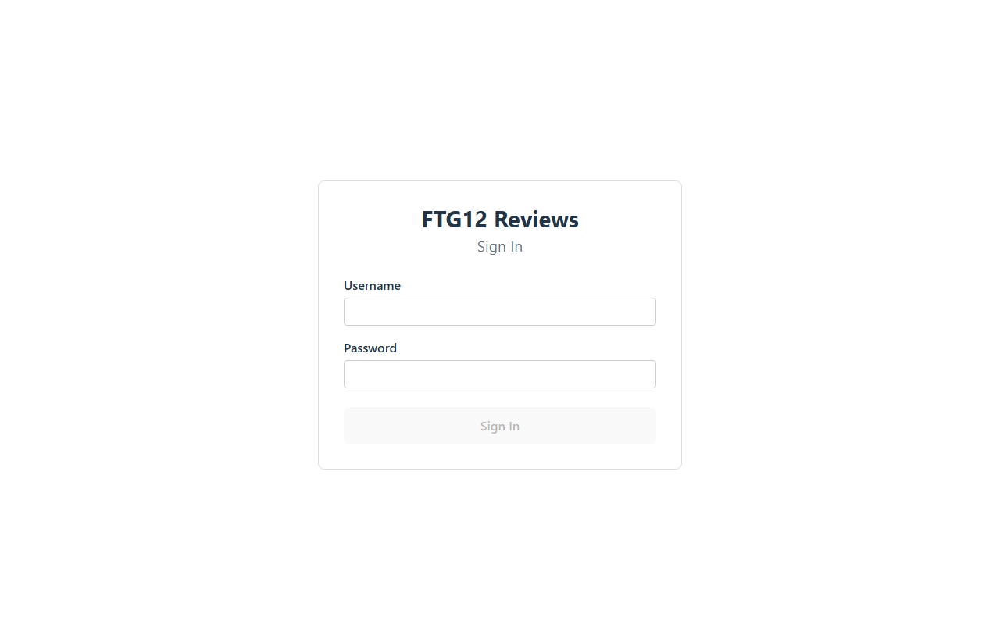
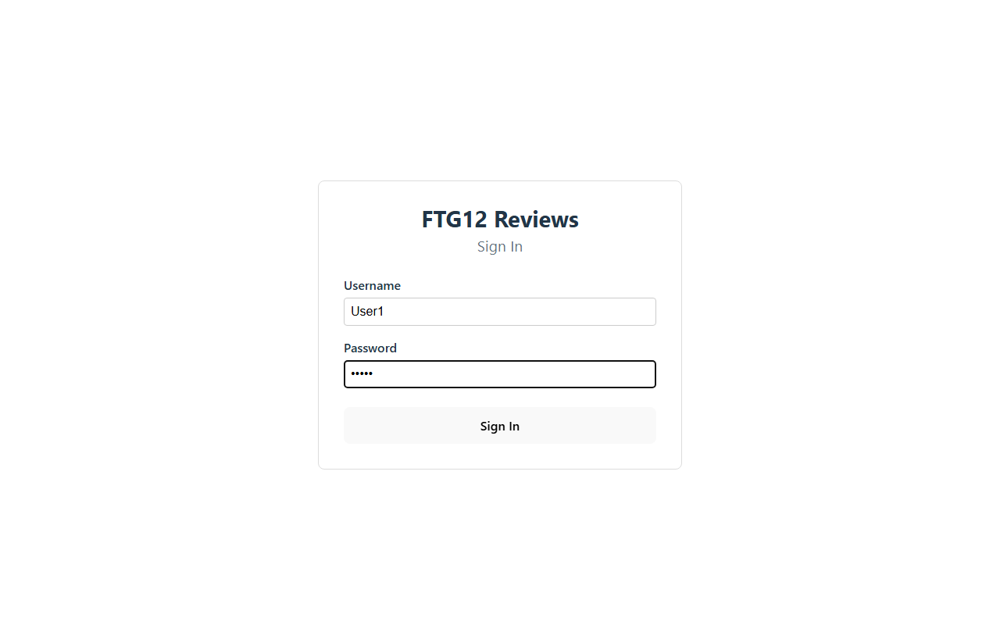
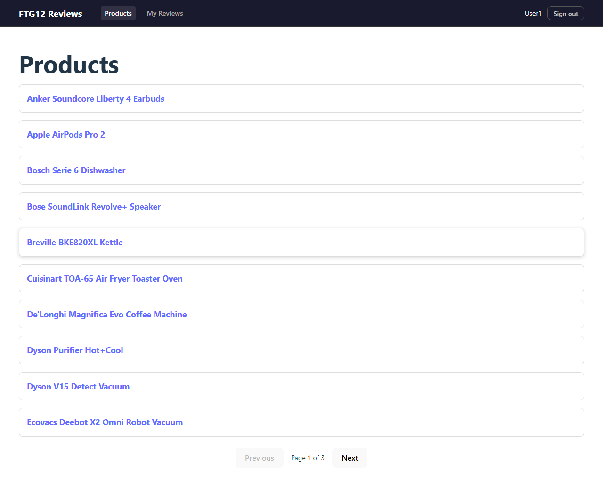
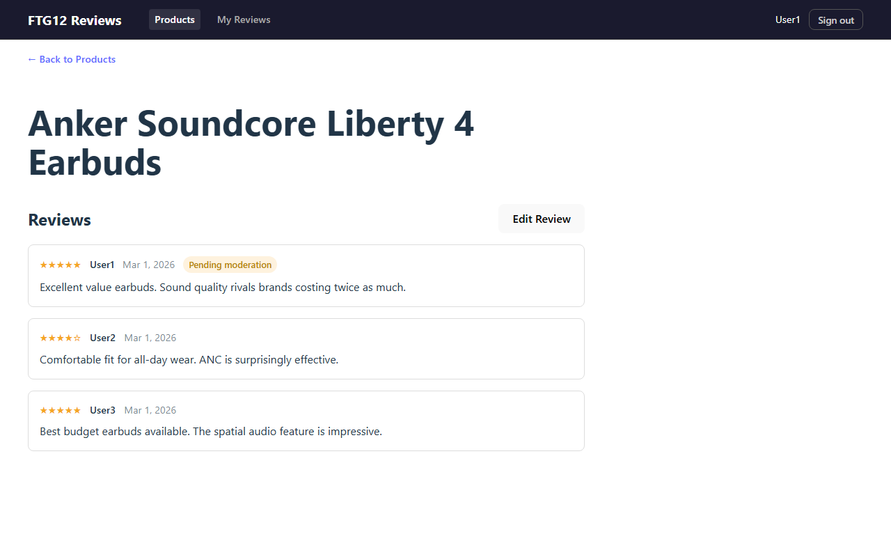
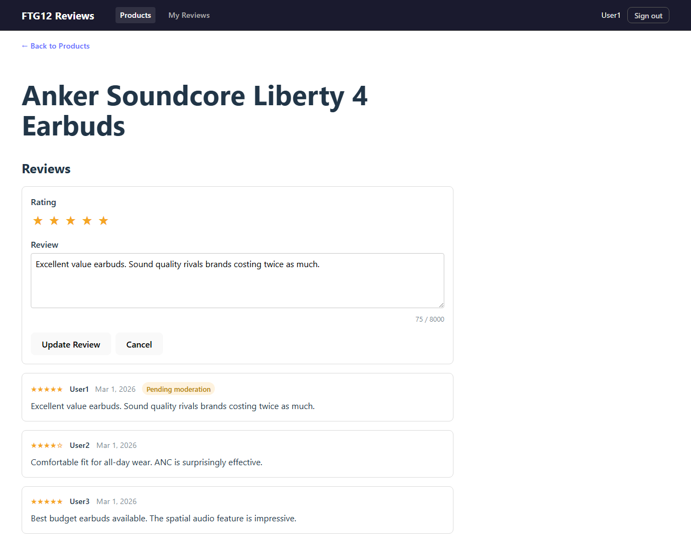
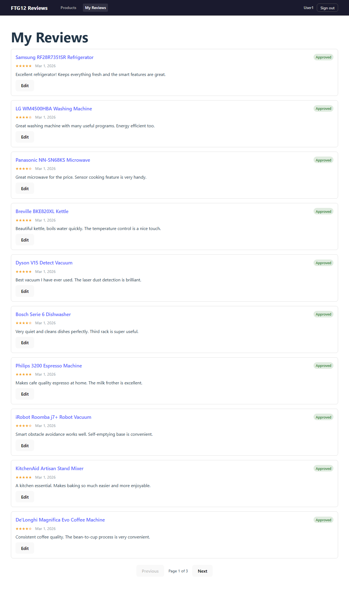
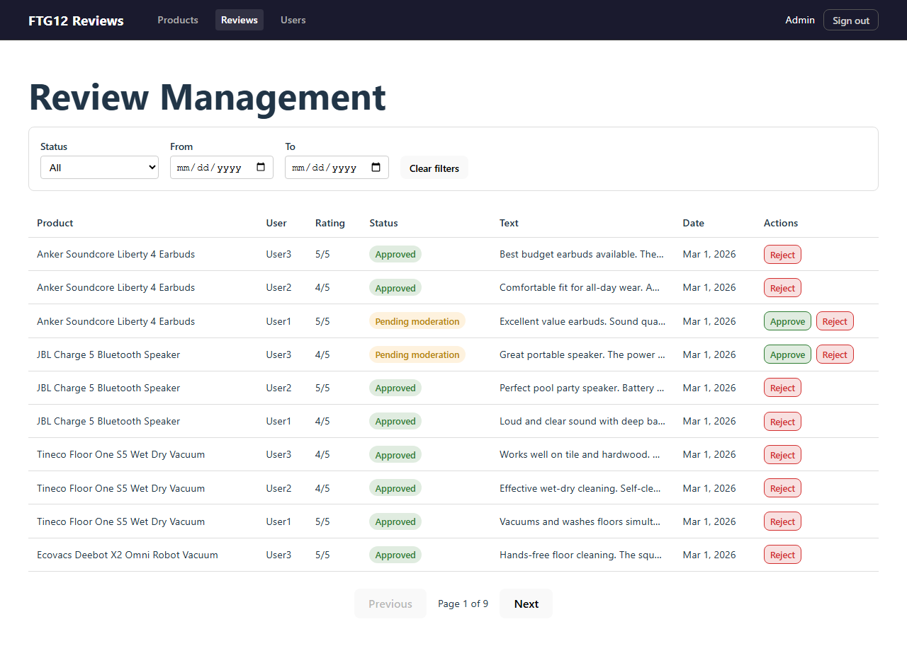
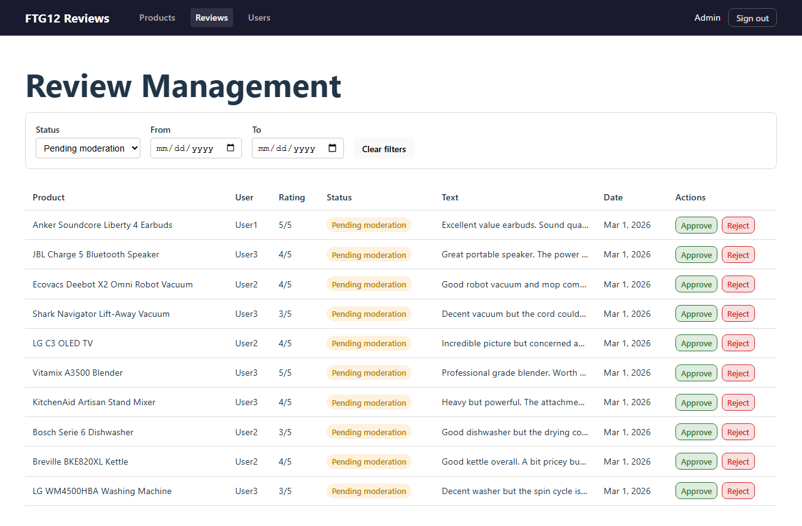
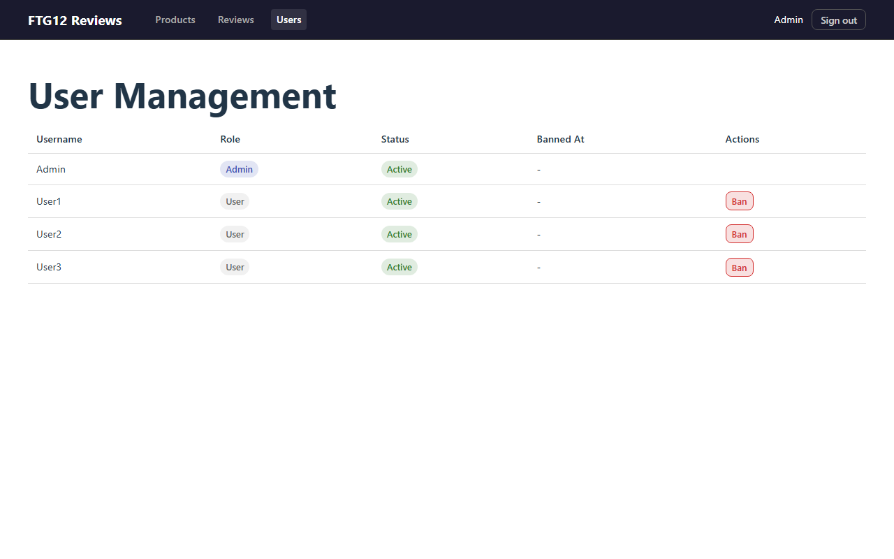

# FTG12 Reviews

**A full-stack product review platform built with ASP.NET Core 10 and React 19.**

FTG12 Reviews lets users browse a catalog of consumer electronics, write star-rated reviews, and track their review history. Administrators moderate submitted reviews (approve / reject) and manage users (ban / restore). The application demonstrates clean architecture, JWT authentication, CQRS with MediatR, and a modern React + TypeScript frontend.

---

## Table of Contents

- [Purpose](#purpose)
- [Who Is This For?](#who-is-this-for)
- [Roles and Permissions](#roles-and-permissions)
- [Quick Start](#quick-start)
- [Main Features](#main-features)
- [User Journeys](#user-journeys)
  - [1. Sign In](#1-sign-in)
  - [2. Browse Products](#2-browse-products)
  - [3. View Product Reviews](#3-view-product-reviews)
  - [4. Add or Edit a Review](#4-add-or-edit-a-review)
  - [5. My Reviews](#5-my-reviews)
  - [6. Review Moderation (Admin)](#6-review-moderation-admin)
  - [7. User Management (Admin)](#7-user-management-admin)
  - [8. Sign Out](#8-sign-out)
- [Notes and Limitations](#notes-and-limitations)
- [Technical Documentation](#technical-documentation)

---

## Purpose

FTG12 Reviews is a training / portfolio project that simulates a real-world product review workflow:

1. **Users** discover products, leave honest reviews with a 1–5 star rating, and revisit their review history.
2. **Administrators** ensure review quality by approving or rejecting submissions, and enforce community rules by banning or restoring user accounts.

The project is designed to showcase end-to-end development skills across a .NET backend and a React frontend, including authentication, authorization, data pagination, and moderation workflows.

---

## Who Is This For?

| Audience | Value |
|----------|-------|
| **Developers** studying the codebase | Clean Architecture, CQRS (MediatR), FluentValidation, EF Core + SQLite, JWT auth, React hooks, TypeScript |
| **Portfolio reviewers / interviewers** | Demonstrates a production-style application with role-based access, moderation flows, and comprehensive tests |
| **Workshop participants** | Step-by-step task backlog (26 tasks) to build the entire app from scratch |

---

## Roles and Permissions

| Capability | Regular User | Administrator |
|------------|:------------:|:-------------:|
| Sign in / sign out | ✅ | ✅ |
| Browse products (paginated) | ✅ | ✅ |
| View approved reviews on a product | ✅ | ✅ |
| See own reviews regardless of status | ✅ | ✅ |
| Create a review (one per product) | ✅ | ❌ |
| Edit own review (resets to Pending) | ✅ | ❌ |
| View "My Reviews" page | ✅ | ✅ |
| Approve / reject reviews | ❌ | ✅ |
| Filter reviews by status and date | ❌ | ✅ |
| Ban / restore users | ❌ | ✅ |
| Ban other administrators | ❌ | ❌ |

> **Banned users** can still sign in and browse, but cannot create or edit reviews. The API returns a 403 error when they try.

---

## Quick Start

### Prerequisites

| Tool | Version |
|------|---------|
| .NET SDK | 10.0+ |
| Node.js | 20.19+ or 22.12+ |
| npm | 10+ |

### 1. Start the backend

```bash
cd backend
dotnet run --project src/FTG12_ReviewsApi
# API on http://localhost:7100
```

### 2. Start the frontend

```bash
cd frontend
npm install   # first time only
npm run dev
# UI on http://localhost:7200
```

### 3. Sign in with a demo account

| Username | Password | Role |
|----------|----------|------|
| `Admin` | `Admin` | Administrator |
| `User1` | `User1` | Regular user |
| `User2` | `User2` | Regular user |
| `User3` | `User3` | Regular user |

Open **http://localhost:7200** and enter any of the credentials above.

---

## Main Features

- **JWT authentication** — stateless token-based login with 24-hour expiry
- **Product catalog** — 29 seeded consumer electronics with paginated browsing (10 per page)
- **Star-rated reviews** — 1–5 stars with free-text content (max 8 000 characters)
- **One review per user per product** — enforced server-side with a 409 Conflict response
- **Own-review visibility** — users see their own pending/rejected reviews on product pages; other users only see approved reviews
- **Review editing** — update text and rating; status resets to "Pending moderation"
- **My Reviews dashboard** — all reviews by the current user with inline editing
- **Admin review moderation** — approve, reject, or re-reject reviews with status/date filters
- **Admin user management** — ban or restore user accounts (admins cannot ban themselves or other admins)
- **Pagination** — all list views support page navigation
- **Responsive layout** — clean top bar with role-appropriate navigation links
- **Light and dark mode** — respects the operating system color scheme preference

---

## User Journeys

### 1. Sign In

Open the application at **http://localhost:7200**. Unauthenticated visitors are redirected to the login page.



Enter a username and password, then click **Sign In**.



- **Regular users** are redirected to the **Products** page.
- **Administrators** are redirected to the **Review Management** page.

---

### 2. Browse Products

After signing in, the **Products** page displays a paginated, single-column list of product cards. Each card shows the product name as a clickable link.



Use the **Previous** / **Next** buttons at the bottom to navigate between pages (10 products per page, 3 pages total with the seeded data).

---

### 3. View Product Reviews

Click a product name to open the **Product Details** page. The page shows the product title and a list of approved reviews. Each review displays:

- Star rating (★ / ☆)
- Author name and date
- Review text
- A status badge (only visible on your own reviews)



A "← Back to Products" link at the top returns to the product list.

---

### 4. Add or Edit a Review

On the Product Details page, regular users see an **Add Review** button (if they haven't reviewed this product yet) or an **Edit Review** button (if they have).

Clicking the button opens an inline form with:

- A **star rating selector** (click a star to set the rating)
- A **text area** for the review content (character count displayed)
- **Submit** and **Cancel** buttons



After submitting, a green success message appears briefly. Editing an existing review resets its status to **Pending moderation**.

> Administrators cannot create or edit reviews — the buttons are hidden for admin accounts.

---

### 5. My Reviews

Navigate to **My Reviews** from the top navigation bar. This page lists all reviews written by the current user, regardless of moderation status.

Each card displays:

- **Product name** (links back to the product page)
- **Status badge** — color-coded: Pending (yellow), Approved (green), Rejected (red)
- Star rating and date
- Review text
- An **Edit** button for inline editing



Pagination controls appear at the bottom when there are more than 10 reviews.

---

### 6. Review Moderation (Admin)

Administrators see **Reviews** in the top navigation bar. The **Review Management** page presents all reviews in a data table with columns for Product, User, Rating, Status, Text, Date, and Actions.



#### Filtering

Use the filter panel at the top to narrow results by:

- **Status** — All / Pending moderation / Approved / Rejected
- **Date range** — From and To date pickers
- **Clear filters** button to reset



#### Actions

| Current Status | Available Actions |
|----------------|-------------------|
| Pending moderation | Approve, Reject |
| Approved | Reject |
| Rejected | Approve |

Each action requires a browser confirmation prompt before executing.

---

### 7. User Management (Admin)

Navigate to **Users** in the admin section of the top bar. The **User Management** page lists all registered users in a table with columns for Username, Role, Status, Banned At, and Actions.



- **Ban** — disables a user's ability to create or edit reviews (shown as a red button)
- **Restore** — lifts the ban (shown as a green button)
- Ban/Restore buttons are **hidden** for administrator accounts and for the currently signed-in user (self-ban prevention)

---

### 8. Sign Out

Click **Sign out** in the top-right corner of the navigation bar. The JWT token is discarded and you are returned to the login page.

---

## Notes and Limitations

| Item | Detail |
|------|--------|
| **In-memory database** | The SQLite database runs in-memory. All data resets when the backend is restarted. |
| **Demo credentials** | Passwords match usernames (e.g., `User1` / `User1`). This is intentional for a training environment — never use this pattern in production. |
| **No registration** | There is no sign-up flow. Use the four seeded accounts. |
| **No HTTPS** | The development setup runs over plain HTTP on ports 7100 (API) and 7200 (UI). |
| **Single-machine setup** | Both servers must run on the same machine; the frontend proxies API calls to `localhost:7100`. |
| **JWT secret** | The signing key is stored in `appsettings.json` for simplicity. In production, use a secrets manager. |
| **No email / notifications** | There is no notification system for review status changes. |

---

## Technical Documentation

For detailed build, run, and test instructions, see:

- [Backend — Build and Run Guide](backend-guide.md)
- [Frontend — Build and Run Guide](frontend-guide.md)

### Tech Stack Summary

| Layer | Technology |
|-------|------------|
| Backend framework | ASP.NET Core 10 (C# 14) |
| Architecture | Clean Architecture, CQRS (MediatR) |
| Database | SQLite in-memory (EF Core + FluentMigrator) |
| Authentication | JWT Bearer + BCrypt password hashing |
| Validation | FluentValidation (MediatR pipeline behavior) |
| Frontend framework | React 19 + TypeScript |
| Build tool | Vite 7 |
| Routing | React Router 7 |
| Testing (backend) | xUnit (unit + integration) |
| Testing (frontend) | Vitest + React Testing Library + MSW |
